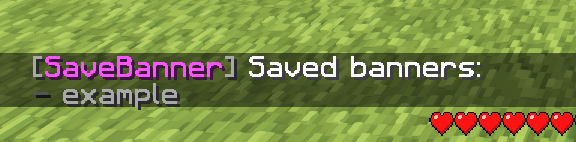
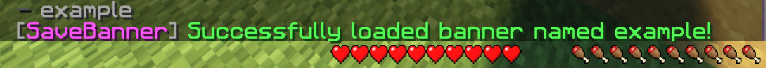

# SaveBanner
A minecraft plugin to save and load banners!

Only tested on Minecraft version 1.20.4. Compiled with Java 17.

https://www.spigotmc.org/resources/savebanner.116709/

<br>

## Commands:
```
- /banner help
- /banner list
- /banner save <name>
- /banner load <name>
- /banner delete <name>
- /banner reload
```
**Commands aliases:** 
- `/savebanner`
- `/banner`
- `/sb`

<br>

## Permissions:
```
savebanner.use - Permission to use SaveBanner.
```

<br>

## Configuration:
### config.yml
The general config of SaveBanner.
```
# The prefix of the plugin. Should end with "&r ".
prefix: "&7[&dSaveBanner&7]&r "
```

### banners.yml
Storage for banners. It's not recommended that you edit this file yourself.
```
# Where banners are stored.
# It's not recommended to edit this file.

savedBanners:
    example:
        ==: org.bukkit.inventory.ItemStack
        v: 3700
        type: BLACK_BANNER
        meta:
            ==: ItemMeta
            meta-type: BANNER
            patterns:
                - ==: Pattern
                  color: LIME
                  pattern: cre
```

<br>

## Screenshots:






<br>

# Created for FoxCraft!
#### Welcome to your next Minecraft server! FoxCraft is a small but growing community of mature players. We have custom enchantments and custom-made plugins. We focus primarily on economy survival but also have creative.

#### Besides the game modes, we offer a balanced economy/shop, vote crates, and awesome time-based ranks. Ranking up unlocks awesome perks like /treefeller, /god, /glow, and /skull.
### What are you waiting for? Join today!

